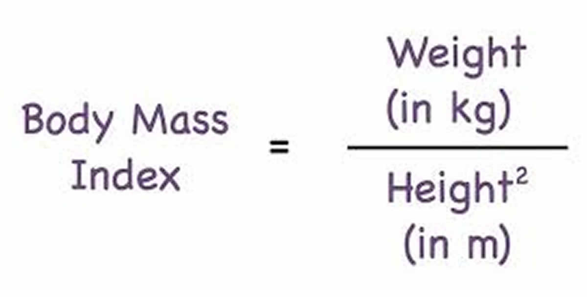
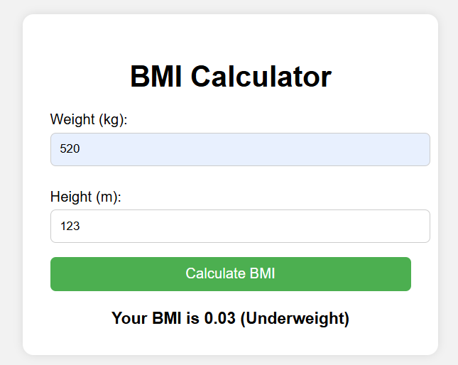

# 🧮 BMI Calculator

A simple and responsive **BMI (Body Mass Index) Calculator** built using **HTML, CSS, and JavaScript**.  
It calculates the user's BMI and classifies them as **Underweight, Normal, Overweight, or Obese** based on standard WHO guidelines.
 
---

## 🚀 Live Demo

🔗 [Click here](https://sumaiyahibrahim.github.io/Bmi-Calculator/)  


---

## 📐 BMI Formula



## 📊 BMI Categories (WHO Classification)

| BMI Range       | Category       |
|-----------------|----------------|
| Below 18.5      | Underweight    |
| 18.5 – 24.9     | Normal weight  |
| 25 – 29.9       | Overweight     |
| 30 and above    | Obese          |

---

## 📁 Features

✅ Real-time BMI calculation  
✅ Clear input validation  
✅ Responsive layout (mobile-friendly)  
✅ Clean and modern design  

---

## 🛠️ Tech Stack

- **HTML** – Markup structure  
- **CSS** – Styling and layout  
- **JavaScript** – BMI calculation logic  

---

## 📷 Screenshots



---

## 👩‍💻 How to Use Locally

1. Clone the repository:
   ```bash
   git clone https://github.com/sumaiyahibrahim/Bmi-Calculator.git
